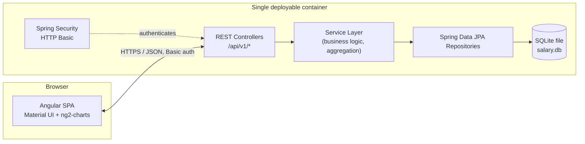
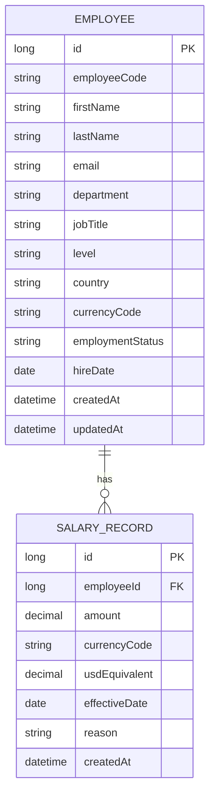

# Architecture & Tech Stack

Companion to [REQUIREMENTS.md](REQUIREMENTS.md). This covers *how* we build what
that document scoped, and why.

## Note on the UI framework
The UI is built with **Angular** (+ Angular Material), matching the frontend
stack named in the role's tech stack. Backend language and database are within
the assessment's open constraints.

## Guiding principles
- **Match complexity to the problem.** 10,000 rows and a single HR-Manager
  persona is a well-understood CRUD + reporting shape — not a distributed
  systems problem. Favor boring, well-supported tools over novelty.
- **One deployable unit.** Ship the SPA and API together to minimize infra
  surface area and cost for a take-home deployment.
- **Push aggregation to the database.** Analytics queries run as SQL
  `GROUP BY`s with indexes, not in-memory loops over 10k Java objects.
- **History over mutation.** Salary changes are appended, never overwritten —
  it's both an audit requirement and the natural shape for "how do we pay
  people *over time*" questions.
- **Entities never leave the service layer.** REST controllers return DTOs,
  not JPA entities — the boundary that keeps persistence-only fields (password
  hashes, lazy-loaded proxies) from ever reaching a response body.

## Tech stack

| Layer | Choice | Why |
|---|---|---|
| Backend | Java 21 + Spring Boot 3 (Web, Data JPA, Security, Validation) | Matches the requested stack; mature ecosystem for REST + JPA + auth with minimal boilerplate. |
| Build | Maven | Most common default for Spring Boot; nothing here needs Gradle's flexibility. |
| Database | SQLite (single file, WAL journal mode) | Constraints explicitly suggest "like SQLite." Single HR-Manager writer, no concurrent-write contention to design around — an embedded file removes an entire deployment dependency (no DB service/cost/networking). WAL mode specifically so reads are never blocked by an in-flight write, the one SQLite setting that actually matters at this access pattern. Schema is accessed only through Spring Data JPA, so swapping to Postgres later is a config change, not a rewrite, if concurrent multi-writer access ever became a real requirement. |
| Migrations | Flyway | Versioned, reviewable SQL migrations instead of Hibernate `ddl-auto` — schema changes stay explicit and reversible once seed data and real HR edits coexist in the same file. |
| Frontend | Angular (latest stable) + TypeScript | Per direction. |
| Component library | Angular Material | Official, first-party; gives us data tables, pagination, forms, and dialogs without hand-rolling. |
| Charts | ng2-charts (Chart.js wrapper) | Lightweight, well-documented, sufficient for bar/line/pie views on the analytics dashboard — no need for a heavier viz library at this scope. |
| State management | Angular services + RxJS only (no NgRx) | Single role, moderate screen count, no cross-cutting shared state complex enough to justify NgRx's ceremony. Revisit if the app grows multiple collaborating modules. |
| Auth | Spring Security + HTTP Basic (stateless) | One in-memory HR Manager account (see [REQUIREMENTS.md](REQUIREMENTS.md) — RBAC is explicitly out of scope). The assessment asks only for "basic authentication," and for a single-user internal tool HTTP Basic is exactly that: no user table, no token lifecycle. Angular holds the encoded credentials in memory (not `localStorage`) via an `AuthService`, attached to every request by an `HttpInterceptor`, with an `AuthGuard` on protected routes. |
| Packaging | Multi-stage Docker build | Stage 1 builds the Angular app; stage 2 builds the Spring Boot jar and copies the Angular `dist/` into `src/main/resources/static`; stage 3 is a slim JRE runtime image. Result: one container, one process, one port. |

## High-level architecture



Angular is served as static resources by the same Spring Boot process that
serves the API — no CORS, no second service to deploy or keep in sync.

## Repository layout

```
/Project
  REQUIREMENTS.md
  ARCHITECTURE.md
  api/                     # Spring Boot (Maven)
    src/main/java/...
    src/main/resources/
    src/test/java/...
    pom.xml
  web/                     # Angular CLI project
    src/app/
    package.json
  Dockerfile                # multi-stage build described above
```

Backend and frontend stay as two independently buildable projects during
development (Angular CLI dev server proxying `/api` to Spring Boot on `:8080`
for hot reload); the Docker build is what fuses them into one artifact for
deployment. No monorepo tooling (Nx/Turborepo) — two projects is too small a
scale to need it.

## Data model



The single HR Manager login is an in-memory Spring Security account (see the
Auth row above), not a database table — there are no users to administer.

- An employee's **current salary** is derived — the `SALARY_RECORD` with the
  latest `effectiveDate` for that employee — not a duplicated column, so
  there's one source of truth. Resolving it for a *page* of employees is one
  query (a correlated subquery / window function keyed on `MAX(effectiveDate)`
  per `employeeId`), never per-row lazy-loading — a 50-row page must not
  become 51 queries.
- `usdEquivalent` is a snapshot captured at record-creation time (fixed rate
  table baked into the seed/service layer), enabling cross-country analytics
  without a live FX dependency (see [REQUIREMENTS.md](REQUIREMENTS.md) exclusions).
- Indexes on `department`, `country`, `level`, `employmentStatus` (Employee)
  and `employeeId`, `effectiveDate` (SalaryRecord) to keep filtering and
  aggregation fast at 10k+ rows. `employeeCode` and `email` (Employee) carry
  `UNIQUE` constraints — natural keys are enforced by the database, not by
  convention.
- Delete is always a **soft-delete** (`employmentStatus = TERMINATED`): the
  employee and their salary history are kept for audit, and termination is a
  real business event that headcount/attrition analytics still needs. There is
  no hard-delete path — one predictable behavior rather than a branch on
  whether salary history exists.

## API design

Authentication is HTTP Basic (see the Auth row above) — every request carries
the credentials; there is no login endpoint.

| Method | Endpoint | Purpose |
|---|---|---|
| GET | `/api/v1/employees` | Paginated list — filter by department/country/level/status, search by name/code, sort |
| GET | `/api/v1/employees/{id}` | Employee detail incl. current salary |
| POST | `/api/v1/employees` | Create employee |
| PUT | `/api/v1/employees/{id}` | Update employee core fields |
| DELETE | `/api/v1/employees/{id}` | Soft-delete (mark terminated) |
| GET | `/api/v1/employees/{id}/salary-history` | List salary records for an employee |
| POST | `/api/v1/employees/{id}/salary-history` | Add a salary record (raise/adjustment/promotion) |
| GET | `/api/v1/analytics/summary` | Org-wide headcount, avg/median salary, total payroll cost (USD) |
| GET | `/api/v1/analytics/by-department` \| `/by-country` \| `/by-level` | Grouped aggregates |
| GET | `/api/v1/analytics/distribution` | Salary distribution buckets |

All list/analytics endpoints are backed by SQL aggregate queries
(`GROUP BY`, `AVG`, window-function medians, `CASE`-based bucketing) run in the
database — never "load all 10k into memory and reduce in Java." The filter
dropdown values (departments, countries, levels) are a fixed, known set for
this single organisation, so the frontend uses static lists rather than a
facets endpoint.

### Error response contract

Every non-2xx response uses one shape:

```json
{
  "error": {
    "code": "EMPLOYEE_NOT_FOUND",
    "message": "No employee with id 4821",
    "details": []
  }
}
```

| Status | When |
|---|---|
| 400 | Malformed request body / query params |
| 401 | Missing or invalid credentials |
| 404 | Resource does not exist |
| 409 | Conflict (e.g., duplicate `employeeCode` on create) |
| 422 | Valid JSON, business-rule violation (e.g., salary `effectiveDate` in the future) |
| 500 | Unexpected server error — logged server-side, generic message to the client, no stack traces |

## Failure modes

| Scenario | Behavior |
|---|---|
| Wrong/missing credentials | API returns `401` in the standard error shape; Angular's `AuthService` clears the in-memory credentials and the guard redirects to login — no silent retry loop. |
| Unknown URL or malformed path param | `404` / `400` in the standard error shape (a bad `/employees/{id}` value is a `400`), never a bare `500` — the global handler maps `NoResourceFoundException`/`MethodArgumentTypeMismatchException` explicitly. |
| SQLite file locked/unreachable | `/actuator/health` reports `DOWN`; requests fail fast with `503` — no retry-forever logic, since a local file lock resolves in milliseconds, not minutes. |
| Duplicate salary-history submission (double-click) | Not de-duplicated server-side at this scope — accepted risk for a single-user internal tool, noted here rather than silently ignored. |

## Testing strategy

**Backend** (JUnit 5 + Mockito):
- Service-layer unit tests (mocked repositories) for business logic: current-salary
  resolution, USD snapshot calculation, soft-delete behavior. Date-dependent logic
  goes through an injected `Clock` so tests stay deterministic.
- `@WebMvcTest` controller tests for request validation, status codes, pagination.
- `@DataJpaTest` runs against the same Flyway-managed schema as production
  (no separate `ddl-auto` schema) for custom repository queries — the
  aggregate SQL is exactly what needs correctness coverage, and this catches
  real migration issues instead of masking them.
- A small number of `@SpringBootTest` integration tests for critical flows
  (create employee → add salary record → shows up in `/analytics/summary`).
- Target: full suite under 30s, no network/filesystem/wall-clock dependencies.

**Frontend** (Angular CLI default: Jasmine/Karma):
- Component tests for employee list/table, salary-history form, and dashboard
  chart components, with `HttpClientTestingModule` mocking the API.
- Unit tests for `AuthService`, the auth interceptor, and the auth guard.

## Deployment

Single Docker image (see layout above) deployed to a free/low-tier host
(Render or Railway — decided at deploy time). Known trade-off: hosts' free
tiers may use an ephemeral filesystem, which would reset the SQLite file on
redeploy. Mitigation: an idempotent startup check re-runs the 10k-employee
seed only if the `employee` table is empty, so the demo is always in a known,
functional state; a persistent volume is a one-line config addition if
we need edits to survive across redeploys during the review window.

## Key trade-offs (summary)

- **SQLite over Postgres**: zero ops for a single-writer MVP; JPA keeps the
  door open to swap later.
- **HTTP Basic over JWT/session cookies**: the ask is "basic authentication"
  for one HR Manager. HTTP Basic is stateless, has no token/session store or
  expiry lifecycle to manage, and drops a whole auth subsystem (login endpoint,
  JWT signing/parsing filter, user table) that this persona doesn't need.
- **No NgRx**: state complexity doesn't warrant it yet.
- **One deployable container over separate FE/BE services**: fewer moving
  parts, no CORS, cheaper/simpler to host for a take-home.
- **Angular + Material**: matches the role's frontend stack; Material gives
  data tables, pagination, forms, and dialogs without hand-rolling them.
- **DTOs over direct entity serialization**: a few extra mapper classes,
  bought in exchange for never risking a lazy-load proxy or persistence-only
  field in an API response.
- **Flyway over `ddl-auto`**: migrations are code-reviewable and reversible,
  which matters the moment seed data and live HR edits share one file.
- **Hibernate `ddl-auto: none`, not `validate`**: the original intent was
  `validate` (catch drift between entities and schema at boot). Running it
  for real surfaced a genuine SQLite constraint: an id column has to be
  declared exactly `INTEGER PRIMARY KEY AUTOINCREMENT` (SQLite's hard
  requirement for autoincrement - `BIGINT` isn't accepted there), but the
  driver then reports that column as `INTEGER` where Hibernate expects
  `BIGINT` for a mapped `Long`, so `validate` fails at boot against a schema
  that is actually correct. Dropped to `none`; the repository tests exercise
  the real Flyway schema directly, so genuine drift still surfaces as a query
  failure, just not as a boot-time check. Worth revisiting if this moves to
  Postgres, where `validate` wouldn't hit the same issue.
